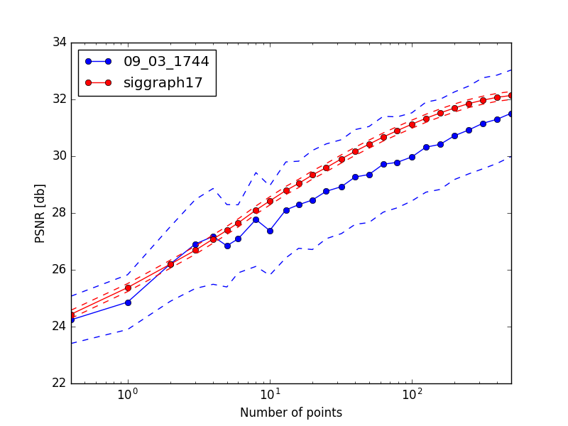

# Interactive Deep Colorization in PyTorch

This is our PyTorch reimplementation for interactive image colorization. The code was written by [Richard Zhang](https://github.com/richzhang) and [Jun-Yan Zhu](https://github.com/junyanz).

This repository contains training code. The original, official GitHub repo (in Caffe) is [here](https://richzhang.github.io/ideepcolor/).


## Prerequisites
- Linux or macOS
- Python 2 or 3
- CPU or NVIDIA GPU + CUDA CuDNN

## Getting Started
### Installation
- Install PyTorch 0.4+ and torchvision from http://pytorch.org and other dependencies (e.g., [visdom](https://github.com/facebookresearch/visdom) and [dominate](https://github.com/Knio/dominate)). You can install all the dependencies by
```bash
pip install -r requirements.txt
```
- Clone this repo:
```bash
git clone https://github.com/richzhang/colorization-pytorch
cd colorization-pytorch
```

### Dataset preparation
- Download the ILSVRC 2012 dataset and run the following script to prepare data
```python make_ilsvrc_dataset.py --in_path /PATH/TO/ILSVRC12```. This will make symlinks into the training set, and divide the ILSVRC validation set into validation and test splits for colorization.

### Training interactive colorization
- Train a model: ```bash ./scripts/train_siggraph.sh```. This is a 2 stage training process. First, the network is trained for automatic colorization using classification loss. Results are in `./checkpoints/siggraph_class`. Then, the network is fine-tuned for interactive colorization using regression loss. Final results are in `./checkpoints/siggraph_reg`.

- To view training results and loss plots, run `python -m visdom.server` and click the URL http://localhost:8097. The following values are monitored:
    * `G_CE` is cross-entropy loss between predicted color distribution and ground truth color.
    * `G_entr` is the entropy of the predicted distribution.
    * `G_entr_hint` is the entropy of the predicted distribution at points where a color hint is given.
    * `G_L1_max` is the L1 distance between the ground truth color and argmax of the predicted color distribution.
    * `G_L1_mean` is the L1 distance between the ground truth color and mean of the predicted color distribution.
    * `G_L1_reg` is the L1 distance between the ground truth color and the predicted color.
    * `G_fake_real` is the L1 distance between the predicted color and the groundtruth color (in locations where a hint is given).
    * `G_fake_hint` is the L1 distance between the predicted color and the input hint color (in locations where a hint is given). It's a measure of how much the network "trusts" the input hint.
    * `G_real_hint` is the L1 distance between the groundtruth color and the input hint color (in locations where a hint is given).


### Testing interactive colorization
- Get a model. Either:
    * (1) download the pretrained model by running ```bash pretrained_models/download_siggraph_model.sh```, which will give you a model in `./checkpoints/siggraph_pretrained/latest_net_G.pth`. Use `siggraph_pretrained` as `[[NAME]]` below.
    * (2) train your own model (as described in the section above), which will leave a model in `./checkpoints/siggraph_reg2/latest_net_G.pth`. In this case, use `siggraph_reg2` as `[[NAME]]` below.

- Test the model on validation data: ```bash python test.py --name [[NAME]] ```, where ``[[NAME]]`` is `siggraph_reg2` or `siggraph_pretrained`. The test results will be saved to a html file in `./results/[[NAME]]/latest_val/index.html`. For each image in the validation set, it will test (1) automatic colorization, (2) interactive colorization with a few random hints, and (3) interactive colorization with lots of random hints.

- Test the model by making PSNR vs number of hints plot: ```bash python test_sweep.py --name [[NAME]] ```. This plot was used in Figure 6 of the [paper](https://arxiv.org/abs/1705.02999). This test randomly reveals 6x6 color hint patches to the network, and sees how accurate the colorization is with respect to ground truth.



- Test the model interactively with the original official [repository](https://github.com/junyanz/interactive-deep-colorization). Follow installation instructions in that repo and run `python ideepcolor.py --backend pytorch --color_model [[PTH/TO/MODEL]] --dist_model [[PTH/TO/MODEL]]`.

## Future

I hope to reimplement the Global Hints Network, as well as older papers [Colorful Image Colorization, ECCV 2016](https://github.com/richzhang/colorization) and [Split-Brain Autoencoders, CVPR 2017](https://github.com/richzhang/splitbrainauto), using this codebase.

## Acknowledgments
This code borrows heavily from the [pytorch-CycleGAN](https://github.com/junyanz/pytorch-CycleGAN-and-pix2pix) repository.
